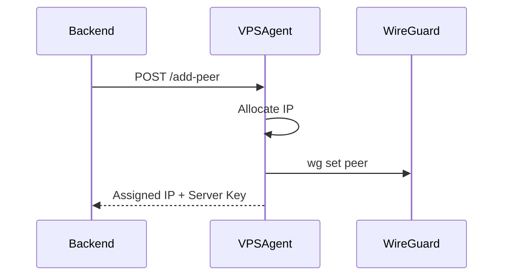

# ⚡ EasyVPN — API Reference

> This document defines the EasyVPN Agent API used by the Control Plane to manage WireGuard peers on VPS nodes.

**[← README](../README.md)** · [Getting Started](GettingStarted.md) · [Architecture](Architecture.md) · [Deployment](Deployment.md) · [Security](Security.md) · [Troubleshooting](Troubleshooting.md)

---

## Overview

Each VPS node runs a lightweight **Flask-based Agent API** exposed internally on:

```text
http://<vps-ip>:5000
```

This API is used exclusively by the EasyVPN backend to:

* Add VPN peers
* Assign IP addresses
* Update WireGuard configuration
* Persist node state

---

## Authentication

All endpoints require an API token.

### Header

```http id="auth01"
X-API-TOKEN: <your_secret_token>
```

If the token is missing or invalid, the request is rejected.

---

## Base URL

```text
http://<VPS_PUBLIC_IP>:5000
```

---

# Endpoints

---

## 1. Add Peer

### Endpoint

```http id="ep01"
POST /add-peer
```

---

### Description

Creates a new WireGuard peer and assigns it an internal VPN IP.

The peer is:

* Immediately activated (no restart required)
* Persisted to disk
* Added to WireGuard runtime config

---

### Request Body

```json id="req01"
{
  "public_key": "CLIENT_WIREGUARD_PUBLIC_KEY",
  "allowed_ips": "10.0.0.5/32"
}
```

---

### Response

```json id="res01"
{
  "status": "success",
  "assigned_ip": "10.0.0.5",
  "server_public_key": "SERVER_WIREGUARD_PUBLIC_KEY"
}
```

---

### Behavior

When called, the agent:

1. Validates API token
2. Finds next available IP in `10.0.0.x`
3. Adds peer using:

```bash id="cmd01"
wg set wg0 peer <PUBLIC_KEY> allowed-ips <IP>/32
```

4. Writes peer to persistent storage
5. Returns server configuration data

---

## 2. Health Check

### Endpoint

```http id="ep02"
GET /health
```

---

### Description

Returns node status for monitoring and registry heartbeat.

---

### Response

```json id="res02"
{
  "status": "online",
  "wireguard": "active",
  "peers": 12,
  "ip_pool_used": 12
}
```

---

## 3. List Peers

### Endpoint

```http id="ep03"
GET /peers
```

---

### Description

Returns all active VPN peers on the node.

---

### Response

```json id="res03"
{
  "peers": [
    {
      "ip": "10.0.0.2",
      "public_key": "xxx",
      "created_at": "2026-01-01T10:00:00Z"
    }
  ]
}
```

---

## Error Responses

---

### 401 Unauthorized

```json id="err01"
{
  "error": "Invalid API token"
}
```

---

### 400 Bad Request

```json id="err02"
{
  "error": "Missing public_key"
}
```

---

### 409 Conflict

```json id="err03"
{
  "error": "No available IP addresses"
}
```

---

## IP Allocation Logic

Each node maintains an internal pool:

```text id="ip01"
10.0.0.2 → 10.0.0.254
```

The agent:

* Tracks assigned IPs in `peers.json`
* Ensures no duplication
* Persists state across restarts

---

## Security Model

### API Protection

* Token-based authentication via `X-API-TOKEN`
* No public unauthenticated endpoints (except health if enabled)

---

### Network Isolation

* WireGuard runs in kernel space
* Only internal subnet is exposed via VPN
* NAT configured automatically by provisioning script

---

## Example Usage

### cURL Request

```bash id="curl01"
curl -X POST http://<VPS_IP>:5000/add-peer \
  -H "X-API-TOKEN: your_secret_token" \
  -H "Content-Type: application/json" \
  -d '{
    "public_key": "CLIENT_PUBLIC_KEY"
  }'
```

---

### Response

```json id="curl02"
{
  "status": "success",
  "assigned_ip": "10.0.0.5",
  "server_public_key": "SERVER_PUBLIC_KEY"
}
```

---

## Integration Flow



---

## Notes

* API is intended for **internal control plane use only**
* Do not expose port 5000 publicly without firewall protection
* WireGuard (51820/UDP) should remain the only public VPN entry point

---

## Next Steps

Continue reading:

* [Security Guide](Security.md) — threat model and protections
* [Troubleshooting Guide](Troubleshooting.md) — common issues and fixes
* [Deployment Guide](Deployment.md) — scaling and production setup

---

## Documentation

| Guide | Description |
| ----- | ----------- |
| [README](../README.md) | Project overview |
| [Getting Started](GettingStarted.md) | Initial installation and setup |
| [Architecture](Architecture.md) | System architecture and design |
| [Deployment](Deployment.md) | Production deployment guide |
| [API Reference](API_Reference.md) | Agent API documentation |
| [Security](Security.md) | Security model and best practices |
| [Troubleshooting](Troubleshooting.md) | Common issues and fixes |
