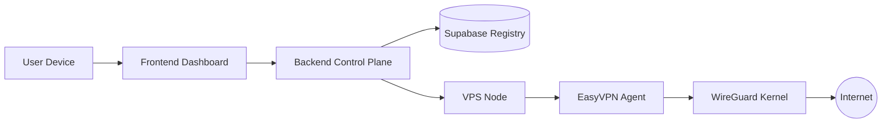
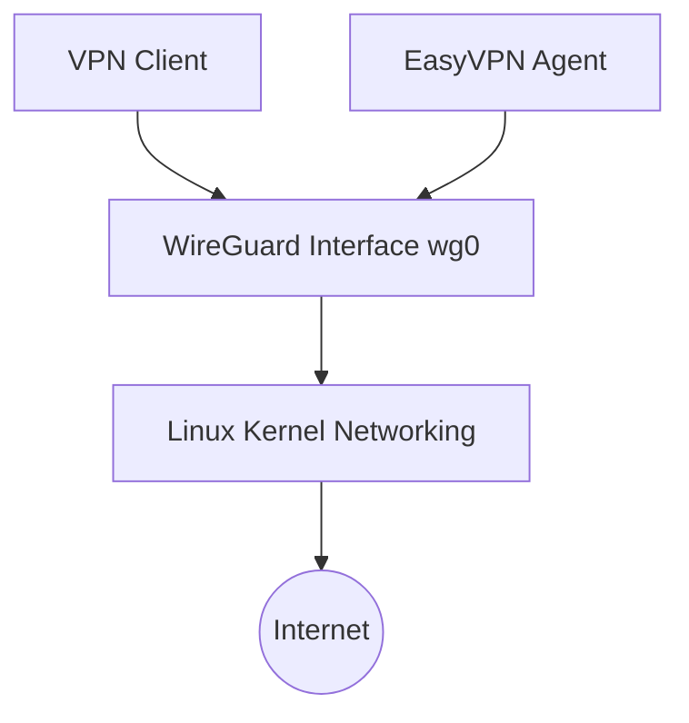
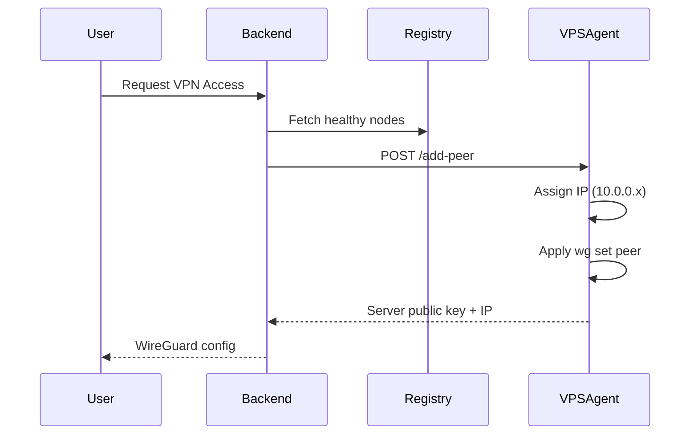

# ⚡ EasyVPN — Architecture Guide

> This document explains how EasyVPN is structured internally and how all components interact.

**[← README](../README.md)** · [Getting Started](GettingStarted.md) · [Deployment](Deployment.md) · [API Reference](API_Reference.md) · [Security](Security.md) · [Troubleshooting](Troubleshooting.md)

---

## System Overview

EasyVPN is built on a **Control Plane / Data Plane separation model**.

* **WireGuard** handles all VPN traffic (data plane)
* **EasyVPN Backend** handles provisioning, orchestration, and discovery (control plane)

---

## High-Level Architecture



---

## Core Layers

### 1. Control Plane (Backend API)

Responsible for:

* Selecting VPN nodes
* Generating WireGuard configurations
* Managing peer lifecycle
* Interacting with Supabase registry
* Orchestrating provisioning requests

> This layer does NOT handle VPN traffic.

---

### 2. Registry Layer (Supabase)

Acts as a lightweight global directory.

Stores:

* Available VPN servers
* Node health (heartbeat)
* Public keys
* Geographic metadata

> Supabase is NOT the source of networking truth — only discovery.

---

### 3. Data Plane (VPS + WireGuard)

Each VPS runs:

* WireGuard kernel module
* EasyVPN Agent API
* NAT + routing rules
* Peer management logic

Handles:

* Encrypted VPN traffic
* Packet routing
* IP forwarding
* Client connectivity

---

## VPS Node Architecture



---

## Control Flow (Peer Creation)

When a user connects:

1. Frontend requests VPN connection
2. Backend selects a healthy VPS node
3. Backend sends public key to VPS Agent
4. Agent assigns internal IP (10.0.0.x)
5. WireGuard peer is added instantly
6. Config is returned to user

---

## Peer Lifecycle



To rotate a client's keys without changing their VPN IP, the backend calls `POST /replace-peer` with the old and new public keys.

---

## Networking Model

### Internal VPN Subnet

```
10.0.0.0/24
```

Each connected client receives:

* Unique IP address
* Persistent peer mapping
* Kernel-level routing entry

---

### NAT Configuration

Each VPS automatically configures:

* IP forwarding
* Masquerading (NAT)
* Interface detection (eth0 / ens5 / etc.)

Result:

> VPN clients gain full internet access through the VPS.

---

## Agent Runtime Model

Each VPS runs an **always-on API service**:

### Responsibilities:

* Accept peer creation requests
* Validate API token
* Allocate IP addresses
* Modify WireGuard runtime config
* Persist peer state to disk

### Key Guarantee:

> No VPN restart is required when adding new peers.

---

## Failure Isolation Design

EasyVPN is designed so that:

### If Backend Fails:

* Existing VPN connections remain active
* WireGuard continues operating normally

### If Supabase Fails:

* Nodes continue serving traffic
* Only discovery is affected

### If VPS Agent Restarts:

* systemd restores service automatically
* peers persist via config files

---

## Security Boundaries

| Component   | Responsibility               |
| ----------- | ---------------------------- |
| WireGuard   | Encryption + traffic routing |
| Agent API   | Peer management              |
| Backend API | Orchestration                |
| Supabase    | Discovery only               |

---

## Design Philosophy

### 1. Control ≠ Data

Control plane failure must never impact VPN connectivity.

---

### 2. Stateless Orchestration

Backend can be replaced without affecting running VPNs.

---

### 3. Infrastructure as Code

VPS nodes are fully reproducible via scripts.

---

## Next Steps

Continue reading:

* [Deployment Guide](Deployment.md) — production deployment model
* [API Reference](API_Reference.md) — agent endpoints
* [Security Guide](Security.md) — threat model and protections

---

## Documentation

| Guide | Description |
| ----- | ----------- |
| [README](../README.md) | Project overview |
| [Getting Started](GettingStarted.md) | Initial installation and setup |
| [Architecture](Architecture.md) | System architecture and design |
| [Deployment](Deployment.md) | Production deployment guide |
| [API Reference](API_Reference.md) | Agent API documentation |
| [Security](Security.md) | Security model and best practices |
| [Troubleshooting](Troubleshooting.md) | Common issues and fixes |
