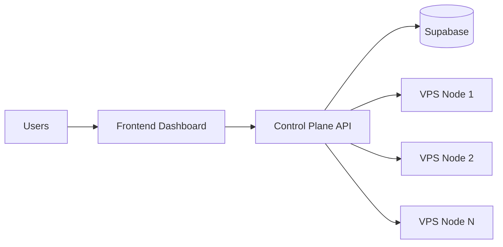
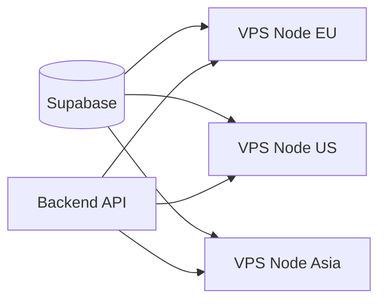
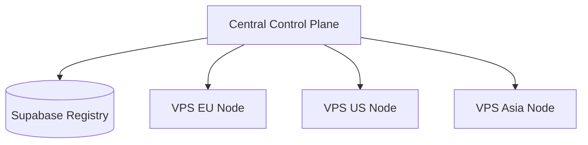

# ⚡ EasyVPN — Deployment Guide

> Production deployment strategy for scaling EasyVPN across multiple VPS nodes and environments.

**[← README](../README.md)** · [Getting Started](GettingStarted.md) · [Architecture](Architecture.md) · [API Reference](API_Reference.md) · [Security](Security.md) · [Troubleshooting](Troubleshooting.md)

---

## Overview

This guide explains how to deploy EasyVPN in a real-world environment with:

* Multiple VPS nodes
* Central control plane
* Supabase registry
* Secure WireGuard networking

---

## Deployment Architecture



---

## Step 1 — Prepare VPS Instance

Each VPS must be:

* Ubuntu 20.04+
* Root SSH access enabled
* Fresh clean installation recommended

---

## Step 2 — Open Required Ports

Before running EasyVPN, configure your cloud firewall:

| Port  | Protocol | Purpose       |
| ----- | -------- | ------------- |
| 5000  | TCP      | Agent API     |
| 51820 | UDP      | WireGuard VPN |

---

### Example Firewall Rule (Azure)


> This is configured at the cloud provider level, NOT inside the VPS.

---

## Step 3 — Install Backend on VPS

On each node:

```bash id="dpl01"
git clone https://github.com/Erebus9456/EasyVPN-Backend.git
cd EasyVPN-Backend
```

---

## Step 4 — Bootstrap System

```bash id="dpl02"
chmod +x bootstrap.sh
./bootstrap.sh
```

This installs:

* WireGuard
* Python dependencies
* System networking configuration
* `.env` setup
* Systemd agent service

---

## Step 5 — Provision Node

```bash id="dpl03"
python3 provision.py
```

This will:

* Configure WireGuard interface
* Enable NAT routing
* Register node in Supabase
* Start persistent agent service

---

## Step 6 — Verify Node Health

After provisioning, verify:

* Node appears in dashboard
* Heartbeat is active
* WireGuard interface is running

```bash id="dpl04"
wg show
```

---

## Scaling Strategy

### Horizontal Scaling

To add more VPN capacity:

1. Spin up new VPS
2. Run bootstrap script
3. Run provisioning
4. Node automatically registers

> No backend redeployment required.

---

### Multi-Region Deployment

You can deploy nodes across:

* AWS (multiple regions)
* DigitalOcean
* GCP
* Azure
* Hetzner
* Oracle Cloud

Each node registers independently into Supabase.

---

## Load Distribution Model

Backend selects nodes based on:

* Availability status
* Heartbeat freshness
* Optional region metadata



---

## Node Lifecycle

### Provisioning

* Bootstrap environment
* Install dependencies
* Configure networking
* Register in Supabase

---

### Runtime

* Accept peer requests
* Assign VPN IPs (10.0.0.x)
* Apply WireGuard peers instantly
* Maintain persistent config state

---

### Failure Recovery

* systemd restarts agent automatically
* peers are restored from local disk
* no external dependency required for runtime stability

---

## Production Best Practices

### 1. Always Use Fresh VPS

Avoid pre-configured VPN or networking setups.

---

### 2. Keep Ports Open

Ensure:

* TCP 5000 remains accessible
* UDP 51820 remains open for VPN traffic

---

### 3. Do Not Modify WireGuard Manually

All configuration is managed by EasyVPN.

Manual edits may break provisioning consistency.

---

### 4. Monitor Heartbeats

Supabase `vpn_servers` table provides:

* Node uptime
* Availability status
* Health tracking

---

## Common Deployment Topology



---

## Zero-Downtime Scaling

EasyVPN supports:

* Adding nodes without downtime
* Removing nodes without affecting active users
* Automatic fallback routing

---

## Next Steps

Continue to:

* [API Reference](API_Reference.md) — agent endpoints
* [Security Guide](Security.md) — security model
* [Troubleshooting Guide](Troubleshooting.md) — debugging guide

---

## Documentation

| Guide | Description |
| ----- | ----------- |
| [README](../README.md) | Project overview |
| [Getting Started](GettingStarted.md) | Initial installation and setup |
| [Architecture](Architecture.md) | System architecture and design |
| [Deployment](Deployment.md) | Production deployment guide |
| [API Reference](API_Reference.md) | Agent API documentation |
| [Security](Security.md) | Security model and best practices |
| [Troubleshooting](Troubleshooting.md) | Common issues and fixes |
