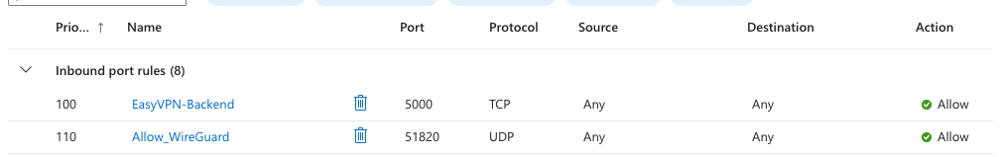

# ⚡ EasyVPN — Getting Started

> This guide helps you deploy your first EasyVPN node in minutes.

**[← README](../README.md)** · [Architecture](Architecture.md) · [Deployment](Deployment.md) · [API Reference](API_Reference.md) · [Security](Security.md) · [Troubleshooting](Troubleshooting.md)

---

## Prerequisites

Before starting, ensure you have:

* An Ubuntu VPS (20.04+ recommended)
* Root SSH access
* A stable public IP
* Basic firewall ports open (see below)

---

## Required Firewall Configuration (IMPORTANT)

Your VPS provider must allow the following inbound traffic:

| Port  | Protocol | Purpose               |
| ----- | -------- | --------------------- |
| 5000  | TCP      | EasyVPN Agent API     |
| 51820 | UDP      | WireGuard VPN Traffic |

---

### Example (Azure NSG Configuration)

Below is an example of correct firewall setup in Azure:



> Ensure these rules are applied at the **cloud firewall level**, not just inside the VPS.

---

## Step 1 — Clone the Repository

```bash
git clone https://github.com/Erebus9456/EasyVPN-Backend.git
cd EasyVPN-Backend
```

---

## Step 2 — Make Bootstrap Executable

```bash
chmod +x bootstrap.sh
```

---

## Step 3 — Run Setup

```bash
./bootstrap.sh
```

This will:

* Install required system dependencies
* Create your `.env` file
* Configure system networking
* Prepare WireGuard environment
* Register your node in the registry

---

## Step 4 — Provision the Node

```bash
python3 provision.py
```

This step will:

* Configure WireGuard interface
* Enable NAT routing
* Register VPS in Supabase
* Start the API agent service

---

## Step 5 — Verify Node

After provisioning:

* Your VPS will appear in the dashboard
* Health status will be visible via heartbeat
* The node will be ready to accept VPN peers

---

## What Happens Next?

Once your node is active:

* It automatically becomes part of the VPN network
* Users can connect via the frontend dashboard
* New peers are assigned dynamically (10.0.0.x range)

---

## Important Notes

* Do NOT manually modify WireGuard config files
* Do NOT disable systemd service (`easyvpn-agent`)
* Keep ports 5000 and 51820 open at all times
* Re-running scripts is safe (idempotent design)

---

## Next Step

Continue to:

* [Architecture Guide](Architecture.md) — how the system works internally
* [Deployment Guide](Deployment.md) — production deployment model
* [API Reference](API_Reference.md) — agent endpoints

---

## Documentation

| Guide | Description |
| ----- | ----------- |
| [README](../README.md) | Project overview |
| [Getting Started](GettingStarted.md) | Initial installation and setup |
| [Architecture](Architecture.md) | System architecture and design |
| [Deployment](Deployment.md) | Production deployment guide |
| [API Reference](API_Reference.md) | Agent API documentation |
| [Security](Security.md) | Security model and best practices |
| [Troubleshooting](Troubleshooting.md) | Common issues and fixes |
