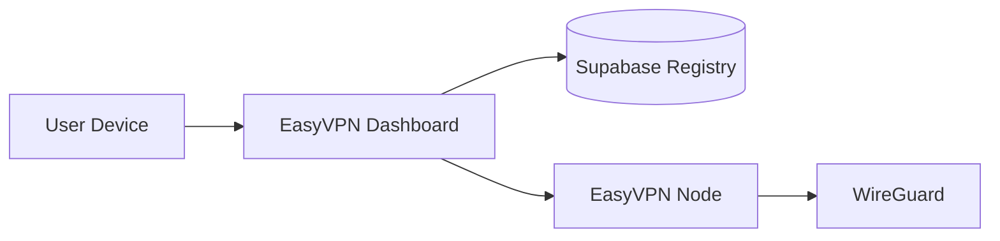
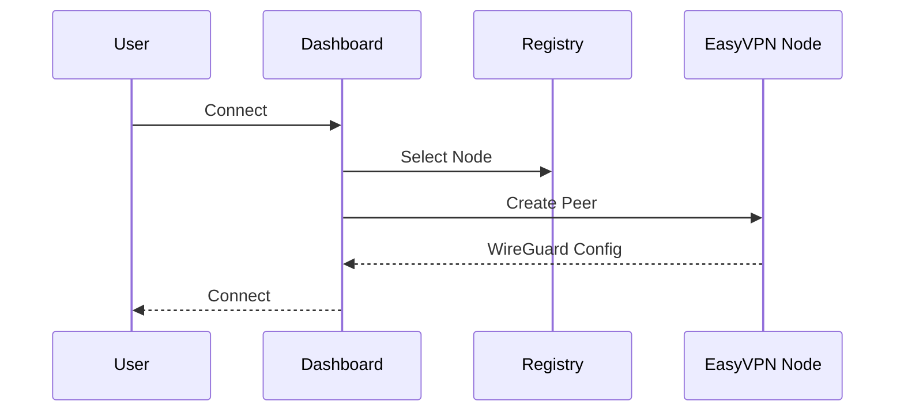

# ⚡ EasyVPN

> Production-grade WireGuard Control Plane for automated VPN infrastructure deployment and management.

<p align="center">
  <strong>Deploy • Discover • Connect • Scale</strong>
</p>

<p align="center">
  Turn any Ubuntu VPS into a self-registering WireGuard node in minutes.
</p>

---

## Tech Stack

<p align="center">
  
  &nbsp;&nbsp;
  
  &nbsp;&nbsp;
  
  &nbsp;&nbsp;
  
  &nbsp;&nbsp;
  
  &nbsp;&nbsp;
  
</p>

---

## Overview

EasyVPN is a **WireGuard infrastructure automation platform** that transforms ordinary Ubuntu VPS instances into managed VPN nodes.

Instead of manually configuring WireGuard servers, networking rules, peer management, and node discovery, EasyVPN automates the entire process through a lightweight control plane.

The result is a scalable VPN infrastructure that can be provisioned, managed, and expanded with minimal operational overhead.

---

## Repository Ecosystem

| Component | Repository |
| --------- | ---------- |
| Backend Control Plane | [EasyVPN-Backend](https://github.com/Erebus9456/EasyVPN-Backend) |
| Frontend Dashboard | [EasyVPN-Frontend](https://github.com/Erebus9456/EasyVPN-Frontend) |

---

## Architecture

For a deeper dive, see the [Architecture Guide](Docs/Architecture.md).



---

## Core Principles

### 🔌 Decoupled by Design

WireGuard handles network traffic.

EasyVPN handles orchestration, provisioning, and peer management.

Existing VPN users remain connected even if the control plane becomes unavailable.

### ⚡ Minimal State

The VPS remains the source of truth.

Supabase is used as a lightweight registry for discovery and health monitoring.

### 🔄 Idempotent Infrastructure

Provisioning scripts can be safely re-run without creating duplicate configuration or breaking existing deployments.

---

## Key Features

* 🚀 One-command VPS provisioning
* 🌍 Automatic node discovery
* 🔐 Secure WireGuard peer management
* ⚡ Instant peer activation without VPN restart
* 🔄 Peer key rotation via `/replace-peer` (refresh config without changing VPN IP)
* 📡 Centralized server registry
* 🔄 Automatic service recovery
* 🧠 Dynamic IP allocation
* ☁️ Multi-cloud compatible
* 🔒 API token protected management endpoints

---

## VPS Requirements

Before deployment, ensure your cloud provider firewall allows:

| Port  | Protocol | Purpose               |
| ----- | -------- | --------------------- |
| 5000  | TCP      | EasyVPN Agent API     |
| 51820 | UDP      | WireGuard VPN Traffic |

### Important

EasyVPN automatically configures:

* UFW rules
* IPTables NAT
* IP forwarding
* WireGuard routing
* Service persistence

You only need to expose the required ports through your VPS provider's firewall or security group.

---

## Quick Start

```bash
git clone https://github.com/Erebus9456/EasyVPN-Backend.git

cd EasyVPN-Backend

chmod +x bootstrap.sh

./bootstrap.sh
```

The bootstrap process will guide you through configuration and automatically provision the server.

---

## Documentation

Detailed documentation is organized into dedicated guides:

| Guide | Description |
| ----- | ----------- |
| [Getting Started](Docs/GettingStarted.md) | Initial installation and setup |
| [Architecture](Docs/Architecture.md) | System architecture and design |
| [Deployment](Docs/Deployment.md) | Production deployment guide |
| [API Reference](Docs/API_Reference.md) | Agent API documentation |
| [Security](Docs/Security.md) | Security model and best practices |
| [Troubleshooting](Docs/Troubleshooting.md) | Common issues and fixes |

---

## Typical Workflow



---

## Use Cases

### Personal VPN Networks

Deploy and manage your own WireGuard infrastructure across multiple VPS providers.

### VPN SaaS Platforms

Use EasyVPN as the control plane powering customer VPN access.

### Internal Corporate Access

Provide secure remote access to private infrastructure.

### Multi-Region Deployments

Operate VPN nodes across multiple countries and cloud providers.

---

## Why EasyVPN?

Traditional WireGuard deployments require manual:

* Server provisioning
* Firewall setup
* Peer management
* Configuration distribution
* Node discovery

EasyVPN automates these tasks and provides a foundation for building scalable VPN infrastructure.

---

## Related Repositories

### Backend

[EasyVPN-Backend](https://github.com/Erebus9456/EasyVPN-Backend)

Infrastructure provisioning, node management, WireGuard automation, and registry integration.

### Frontend

[EasyVPN-CLI](https://github.com/Erebus9456/EasyVPN-CLI)

Administrative dashboard, node monitoring, provisioning workflows, and management UI.

---

<p align="center">
  <strong>Built for scalable, programmable VPN infrastructure.</strong>
</p>

<p align="center">
  WireGuard • Python • Flask • Supabase • Linux Networking
</p>
