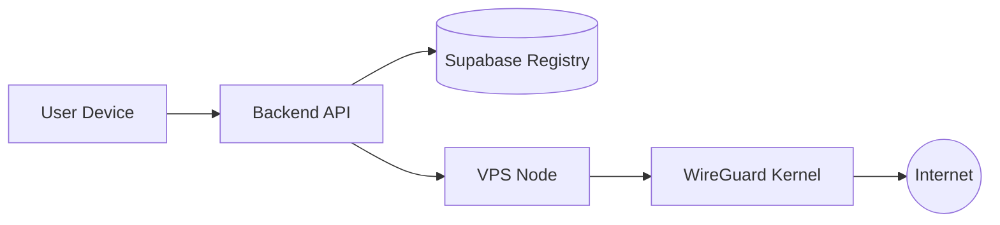
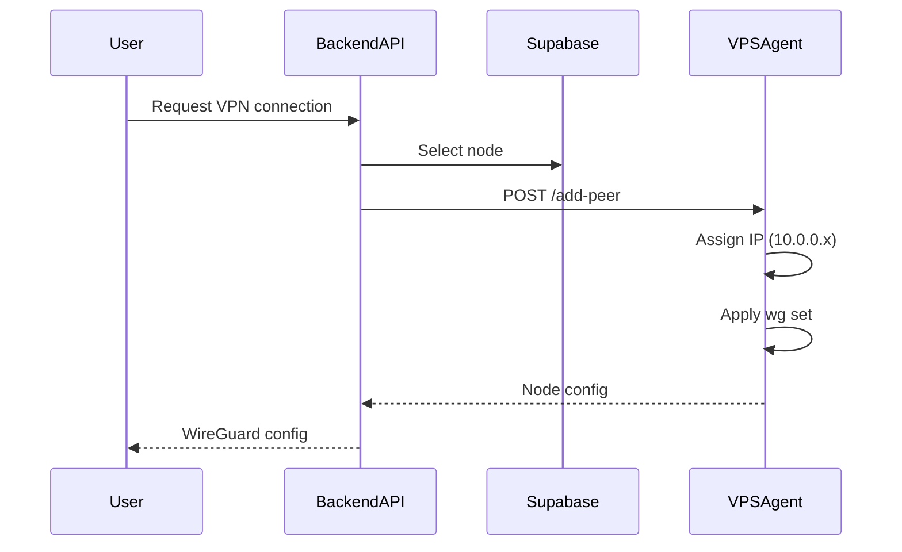

# ⚡ EasyVPN

> Production-grade, API-driven WireGuard VPN Control Plane for instant VPS provisioning and multi-node VPN orchestration.

<p align="center">
  
  
  
  
  
</p>

<p align="center">
  EasyVPN Backend • WireGuard Automation • VPS Provisioning • Control Plane Architecture
</p>

---

## Tech Stack

<p align="center">


&nbsp;&nbsp;

&nbsp;&nbsp;

&nbsp;&nbsp;

&nbsp;&nbsp;

&nbsp;&nbsp;

&nbsp;&nbsp;


</p>

---

## Overview

**EasyVPN** is a fully automated VPN infrastructure control plane designed to turn any fresh Ubuntu VPS into a self-registering WireGuard node.

It separates concerns cleanly:

* WireGuard handles **data plane traffic (VPN packets)**
* EasyVPN handles the **control plane (provisioning, orchestration, discovery)**

---

## Repository Ecosystem

| Component             | Repository                                     |
| --------------------- | ---------------------------------------------- |
| Backend Control Plane | https://github.com/Erebus9456/EasyVPN-Backend  |
| Frontend Dashboard    | https://github.com/Erebus9456/EasyVPN-Frontend |

---

## Architecture



---

## Core Design Principles

### 1. Decoupled Architecture

* WireGuard runs in kernel space
* EasyVPN manages orchestration only
* VPN traffic continues even if backend is down

### 2. Minimal State

* Supabase = discovery layer only
* VPS = source of truth for networking
* Local JSON files = runtime cache

### 3. Idempotency

Scripts can be re-run safely without duplication or breakage.

---

## System Components

### bootstrap.sh

* Installs dependencies
* Generates `.env`
* Explains configuration interactively

### provision.py

* Installs WireGuard
* Configures NAT + IP forwarding
* Creates wg0 interface
* Registers node in Supabase
* Installs systemd service

### agent.py

* Flask API running via Gunicorn
* Endpoint: `POST /add-peer`
* Dynamically assigns VPN IPs (10.0.0.x)
* Applies peers using `wg set`
* Ensures persistence across reboot

### state.json

* Server identity
* Public/private key references

### peers.json

* Allocated VPN IP registry

---

## Supabase Schema

### vpn_servers

| Field                | Purpose              |
| -------------------- | -------------------- |
| id                   | Server ID            |
| name                 | Display name         |
| public_ip            | Node endpoint        |
| wireguard_public_key | Identity             |
| status               | Health state         |
| last_heartbeat       | Node uptime tracking |

### metadata (UI layer)

| Field        | Purpose      |
| ------------ | ------------ |
| country_code | Geo grouping |
| city         | UI display   |

---

## Workflow



---

## Security Model

* API secured via `X-API-TOKEN`
* Root-only WireGuard configuration
* NAT isolation per interface
* No private key exposure outside VPS
* Systemd auto-restart for resilience

---

## Deployment

```bash
chmod +x bootstrap.sh
./bootstrap.sh
```

```bash
python3 provision.py
```

Agent runs automatically via systemd:

```
easyvpn-agent.service
```

---

## File Summary

| File         | Purpose              |
| ------------ | -------------------- |
| bootstrap.sh | System bootstrap     |
| provision.py | Infrastructure setup |
| agent.py     | Runtime API          |
| .env         | Secrets              |
| state.json   | Server state         |
| peers.json   | IP allocation state  |

---

## Key Insight

EasyVPN is not a VPN server.

It is a **control plane for distributed WireGuard infrastructure**:

* WireGuard = Data plane
* EasyVPN = Orchestration layer
* Supabase = Registry layer

---

<p align="center">
Built for scalable, programmable VPN infrastructure.
</p>

<p align="center">
Python • Flask • WireGuard • Linux Networking • Supabase • Infrastructure Automation
</p>
